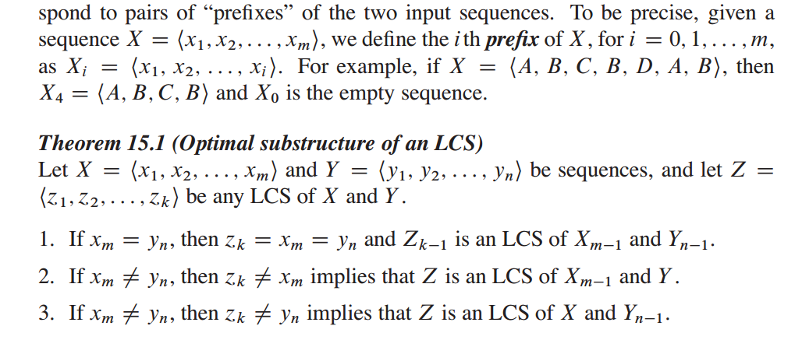
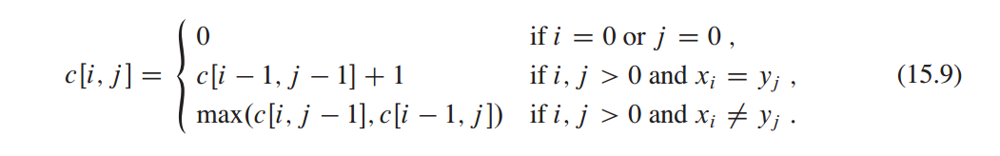
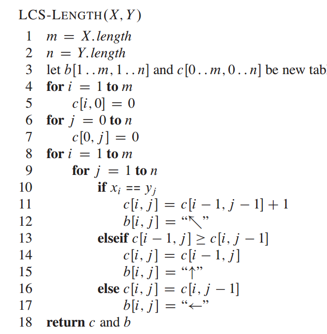
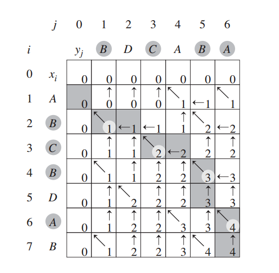

# Favorite Color Stripe

[不能理解的DP reference](https://blog.csdn.net/tjj1998/article/details/79951718)

只可以向后寻找，后面的不能够插队。

color不会为0.

if (v[a])，如果优先值在M内？，也就是hash[a] > 0。

当只输入一个的时候，保存从 [1, L] 的状态。

[最长公共子序列变种](https://blog.csdn.net/tiantangrenjian/article/details/19921051)

#### DP

只不过从左上，左，上选择最大值，然后与LCS不同点就是，这个地方相同就是 max + 1，而不是等于左上 + 1，因为需要的可以重复，并且是最大化串。

    结果：
    compiled!
    testing:
    1 2 2 2 2 2 2 2 2 2 2 2
    1 2 2 2 2 2 2 3 3 3 3 3
    1 2 2 3 3 3 3 3 4 5 5 5
    1 2 2 3 4 5 5 5 5 5 6 6
    1 2 2 3 4 5 6 6 6 6 6 7
    7

在CLRS的Section 15.4，dp里面，LCS。

三个case：

    case 1 : 左上
    case 2 : 左
    case 3 ：上

    case 1 : 左上
    case 2 : 左
    case 3 ：上

